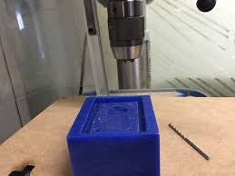

# FABLAB REVOLUTION
Its always interesting to learn something new.Especially something that is revolutionary and has a promising future.
The crash course in [FAB](http://www.fabfoundation.org/)LAB would guide anyone into fascinating world of creativity.

[MESCEFABLAB](https://www.fablabs.io/labs/mesce) is one of the 20 mini fablab in Kerala where the students have the oppurtunity to explore FAB world.

## ABOUT ME

[](https://m.facebook.com/AnurudhG?refid=46&sld=eyJzZWFyY2hfc2lkIjoiZjU4NmI5Yjc5MTM2MGJhM2U1M2I3ZmY0M2VlN2ZjOTciLCJxdWVyeSI6ImFudXJ1ZGggZ29wYWxha3Jpc2huYW4iLCJzZWFyY2hfdHlwZSI6InBlb3BsZSIsInNlcXVlbmNlX2lkIjoxOTk3NzE4Njc2LCJwYWdlX251bWJlciI6MSwiZmlsdGVyX3R5cGUiOiJwZW9wbGUiLCJlbnRfaWQiOjEwMDAwMzkwMTAzNTI4NCwicG9zaXRpb24iOjAsInJlc3VsdF90eXBlIjoyMDQ4fQ%3D%3D&fref=search)


 Graduating in B.Tech Mechanical engineering at [M.E.S College of Engineering](http://www.mesce.ac.in/).Interested in Designing and Manufacturing and completed crash course on basics of AUTOCAD.Planning to do M.S in Automotive Engineering.Likes to travel a lot and have a good love for music and arts([Kolkali](https://www.youtube.com/watch?v=jP5lA3Zhj40)).Native place is Kalpetta of Wayanad district.

```markdown
DETAILS TO GET IN CONTACT WITH ME;

 EMAIL:anurudh0007@gmail.com
 FACEBOOK ID:Anurudh Gopalakrishnan
 TELEGRAM:Anurudh G
 MOBILE:+919645195719
```
## FAB LAB TRAINING (2ND AUG 2017-)
                Being the part of FABLAB training was a great oppurtunity.No one ever  would miss that.The central theme of FABLAB is 'HOW TO MAKE ALMOST ANYTHING'.
                 
## DAY ONE (GLIMPSES OF REALISATION)
   
Our trainer Mr.Jaseel was successful in explaining the main theme of the entire programme.He made as aware about the future scopes of FAB and was able to convince as how the same can influence the future world.
### fablab
   
 To put it very simply, fab lab is a mini factory of sorts where anyone can work on an idea and build a prototype, which would then help to figure out potential market for the product.It has wide variety of machines to make thing possible as we wish.Anything can be rebuild with a short span without much complicated manufacturing procedures.
   
```markdown
   $ Precision cutter
   $ Carving machine
   $ Drillers
   $ Laser cutter
   $ Milling machines
   $ 3D printers 
   $ Moulding machines
   $ Mini furnaces
```
    
                                                   The above mentioned are some of the important machines and tools used for making your come true into its physical format.While fab labs have yet to compete with mass production and its associated economies of scale in fabricating widely distributed products, they have already shown the potential to empower individuals to create smart devices for themselves. These devices can be tailored to local or personal needs in ways that are not practical or economical using mass production.

### Precision cutter 
               
     
     
 A CNC Engraving machine is the art of cutting or carving grooves  
 or characters into a surface. The more common forms are hand eng
 raving, mechanical engraving (pantographs, computer engravers, 
 CNC engraving, etc.) and a variety of photographic and chemical
 etching processes.Rotary Engraving, or CNC Routing, is done with
 a rotating tool or cutter in a motorized spindle. The process is
 similar to routing and is used to produce cuts of specified widths
 and depths in a wide variety of materials.
 
### Drillers
                                                         
                                                         
In rock drilling, the hole is usually not made through a circular 
cutting motion, though the bit is usually rotated. Instead, the 
hole is usually made by hammering a drill bit into the hole with
quickly repeated short movements. The hammering action can be pe
rformed from outside of the hole (top-hammer drill) or within the
hole (down-the-hole drill, DTH). Drills used for horizontal drill
ing are called drifter drills.

### Laser cutter

Laser cutting is a precise method of cutting a design from a given
material using a CAD file to guide it. There are three main types 
of lasers used in the industry: CO2 lasers Nd and Nd-YAG. We use 
CO 2 machines. This involves firing a laser which cuts by melting,
burning or vaporizing your material. You can achieve a really fine
level of cutting detail on with a wide variety of materials. Bare 
in mind that CO 2 lasers can’t cut metals and hard materials, they
can however engrave them
 
### Milling machine


The milling machines are also known as the multi-tasking machines 
(MTMs) which are multi-purpose machines capable of milling and tu
rning the materials as well. The milling machine has got the cutt
er installed up on it which helps in removing the material from t
he surface of the work piece. When the material gets cooled down 
then it is removed from the milling machine.

### 3D Printers

3D printing or additive manufacturing is a process of making three
dimensional solid objects from a digital file.The creation of a 3D
printed object is achieved using additive processes. In an additi
ve process an object is created by laying down successive layers 
of material until the object is created. Each of these layers can 
be seen as a thinly sliced horizontal cross-section of the eventu
al object

### Moulding machine



Injection molding machine molds can be fastened in either a horizo
ntal or vertical position. The majority of machines are horizontal
ly oriented, but vertical machines are used in some niche applicat
ions such as insert molding, allowing the machine to take advantage
of gravity. Some vertical machines also don't require the mold to 
be fastened. There are many ways to fasten the tools to the platens
, the most common being manual clamps (both halves are bolted to t
he platens); however hydraulic clamps (chocks are used to hold the
tool in place) and magnetic clamps are also used

### Mini furnaces


Furnaces feature rugged ceramic tops and bottoms with durable alum
inum alloy sides. As a result, they are 20 to 25 percent lighter t
han comparable ceramic-shell furnaces and 40 to 45 percent lighter
than aluminum-frame furnaces. This reduction in furnace weight is 
a particularly important consideration in hand pouring operations
. Their removable front and back inspection and access panels make
Mini-Melt™ Furnaces easier to maintain and cost less to repair th
an shell furnaces and aluminum frame furnaces. These furnaces ha
ve a strong, durable construction for long furnace life. They al
so operate at frequencies from 3,000 to 10,000 hertz  with maxim
um power utilization

## DAY TWO( DOCUMENTATION AND SOFTWARE BASICS)

      
 Came to know about some of the basic documentation requirements:
```markdown
   $ A self owned webpage/site
   $ HTML coding
   $ Tips for proper handling
```
   
 Although my trade is Mechanical now I am to able to handle my own
 web page.Learned about softwares that is necessary for fablab act
 ivties such as:
```markdown
 $ Eagle
 $ Cura
 $ Autocad
 $ Solidworks
 $ Rhinoceros
 $ Shopbot sofware
 $ Cutstudio(3D)
 $ Sketchup(2D)
```
###  TUTORIAL FOR STARTING A WEB PAGE(Example:GITHUB)

```markdown             
 $ Go to GITHUB
 $ Sign up up by providing necessary details
 $ Then Sign in into the account
 $ Select 'START A PROJECT' to create new repository
 $ Give a suitable repository name
 $ Select 'CREATE REPOSITORY'
```
 You have your Hithub page.Explore!!!!
  
### HTML CODING
    
 We need to know some basic HTML coding to maintain a page.Following
 is the step to code the page in previously created account on GITHUB:
```markdown
$ Login into GITHUB account
$ Select your ID on right bottom corner
$ Now select 'CODE' on the menu
$ Select your already created project, as mentioned in above section
$ Click on the edit button on the panel on right side(PEN symbol)
$ The coding page appears. Code it according to the need.
       For those who are new to coding.A model coding page na
       med 'README.md' is available on 'CODE' page.This can ut 
       ilised to learn coding.
$ After coding click 'COMMIT CHANGES'.Check the page for the updates.
       Also visit w3schools.com to learn some basic coding.
```       
       
## SOFTWARE TOOLS FOR FABLAB

### EAGLE

Eagle Software ascertains itself as a paramount institution in provid
ing software products and solutions for Health Care, Micro-Finance, 
Insurance and Immigration. We develop mobile phone games, online lott
ery applications and deliver value added services for mobile phone ga
mes. We deliver end-to-end solutions for web and desktop applications
based on Smart Card / RFID Solutionstechnology.
Download [EAGLE](https://www.autodesk.com/products/eagle/free-download)
 
### CURA

Cura creates a seamless integration between hardware, software and mate
rials for the best 3D printing experience around.
Novices can start printing right away and experts are able to customize
200 settings to achieve the best results for their models
Optimized profiles for Ultimaker materials
Supported by a global network of Ultimaker certified service partners
Print multiple objects at once with different settings for each object
Cura supports STL, 3MF and OBJ file formats
It’s open source and completely free
Optimized for dual extrusion printing with Ultimaker 3
Download [CURA](http://en.freedownloadmanager.org/Windows-PC/Cura-FREE.html)
### AUTOCAD

AutoCAD is a commercial computer-aided design (CAD) and drafting software
application. Developed and marketed by Autodesk,[1] AutoCAD was first rel
eased in December 1982 as a desktop app running on microcomputers with in
ternal graphics controllers.[2] Prior to the introduction of AutoCAD, most
commercial CAD programs ran on mainframe computers or minicomputers, with
each CAD operator (user) working at a separate graphics terminal.[3] Since
2010, AutoCAD was released as a mobile- and web app as well, marketed as 
AutoCAD 360.
Download [Autocad](http://en.freedownloadmanager.org/Windows-PC/Cura-FREE.html)
### SOLIDWORKS
 
SOLIDWORKS solutions cover all aspects of your product development process
with a seamless, integrated workflow—design, verification, sustainable des
ign, communication and data management. The intuitive design interface and
integrated software work together and give you the freedom to focus on inn
ovation, thus giving you the possibility to span multiple disciplines with
ease.
Download [SOLIDWORKS](http://www.solidworks.in/sw/support/downloads.htm)
### RHINOCEROS

Rhinoceros, also known as Rhino or Rhino3D, is a 3D CAD modeling software
package that enables you to accurately model your designs ready for rende
ring, animation, drafting, engineering, analysis, and manufacturing. Rhino
is a free-form NURBS surface modeler. With Rhino, you can create, edit, an
alyze, and translate NURBS curves, surfaces, and solids in Windows or Mac 
environments. There are no limitations on complexity, degree, or size of 
the model you design.
Download [RHINOCEROS](https://www.rhino3d.com/download)
### CUTSTUDIO 

Easy Cut Studio is the industry's premiere sign making and vinyl cutting sof
tware for Windows that allows you to cut any TrueType font, any SVG image a
nd any design you want using an electronic cutting machine ( vinyl cutter a
nd cutting plotter). Works with your installed TrueType and OpenType, and Di
ngbat/Wingding fonts. This viny cutting software can import various file fo
rmats but also provides a full set of drawing and editing tools to create yo
ur own designs for cutting.
Download [CUTSTUDIO](http://filehippo.com/download_easy-cut-studio/)

## DAY THREE(3D PRINTING)
 Designed a small scaled 3d solid model that is about 5x5x5mm dimension.And 3D
 printed it in [ULTIMAKER](https://en.wikipedia.org/wiki/Ultimaker).
### DESIGNING IN SOLIDWORKS
     
```markdown
$Open new file by selecting 'NEW' from 'FILE'on menubar.
$Select 'PART' from the pop-up window.(As we are designing a small part)
'Assembly' option is used to combine parts
```


```markdown
$Select the plane to draw solid from left side panel
```


```markdown
$Click on 'SKETCH' on mid left corner.
$Using the suitable drawing tools draw 2D model of the required solid shape.
For example for a cube.
```


```markdown
$Then select'EXTRUDE BOSS' option on same mid left corner.
$The extrude features dialogue box appears.
      Choose direction of projection/extrusion by clicking 'DOUBLE ARROW' but
      ton. 
      Select 'BLIND' from the drop-down selection.
      Enter dimension of extrusion (Depth).
$Doble click on 'GREEN TICK MARK' to complete extrude.
```


```markdown
$To cut a shaped hole do as the same steps of extrude.
      Instead of 'EXTRUDE BOSS' select 'EXTRUDE CUT'
      Enter dimension of cut(Depth)
```


```markdown
   Similarly design a random solid shape as the wish.
$Select 'SAVE' from 'FILE' menu.Choose extension'STL' to save.
```


### PRINTING IN ULTIMAKER

We use the software 'CURA' for printing in ULTIMAKER.After creating a 3d model an
designing software open CURA.And follow steps:

```markdown
$Open the designed model from 'FILE'-'OPEN FILE'.Or drag the file into box visible 
on the CURA window.
```


```markdown
$Choose 'NOZZLE'(.6mm,recomended)
        'MATERAIL'(PLA-plastic,recomended)
        'PROFILE'(FINE,recomended)
        'INFILL'(20%,recomended)
$Tick on 'GENERATE SUPPORT',if there is projections on the model designed.
$Tick on 'BUILD PLATE ADHESION",if the solid is to be printed on a plate.
```


```markdown
$Certain orientation options are available on left panel to position the model
according to the requirement.
$Select 'LAY FLAT' option to keep the model parallel and flat to machine table.
```


```markdown
$Click on 'SAVE FILE' option on right bottom corner.
$Choose the destination and save the file.
```

Now copy the file generated in CURA to the memmory card of the ULTIMAKER machine.


```markdown
$Switch on ULTIMAKER
$Select 'PRINT' from the lower bottom screen using the knob.
```


```markdown
$Choose the file that we generated.
$The estimated time for printing will be displayed on the screen.
$Choose 'START'.
```
YOUR MODEL WITH SELECTED SPECIFICATION WILL BE PRINTED!!!!!!

### PRINTING MY FIRST 3D PRINTING MODEL


### PRINTING ADHESION PLATE


### FINAL PRODUCT


      

